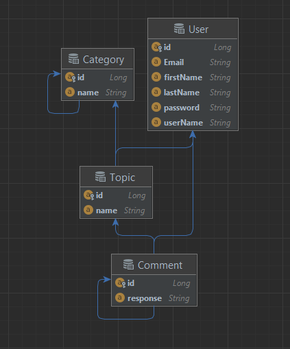

# Fórumrendszer (backend)
 
## Kezdetleges séma

## Adatbázis használat

MySQL adatbázist használok a 3306-os default porton, `mydb` adatbázisnévvel, azon belül a táblák generáltak. adatbázis paraméterek a db.properties fájlban

## Swagger hozzádva a projekthez

http://localhost:8080/swagger-ui/